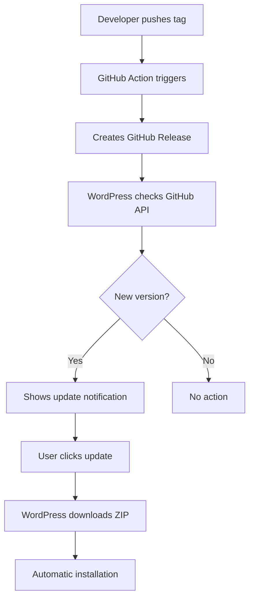

# 🚀 GitHub Automatic Updates Setup Guide

Šis guide'as paaiškins, kaip sukonfigūruoti pilnai automatinių atnaujinimų sistemą naudojant GitHub releases.

## ✅ Kaip veikia sistema

**WordPress automatiškai tikrina jūsų GitHub releases ir siūlo atnaujinimus vartotojams.** Jokių webhook'ų ar papildomų servisų nereikia - viskas veikia "out of the box"!

## 📋 Reikalavimai

- GitHub repository
- WordPress plugin su versijos valdymu
- Git komandų išmanymas

## 🔧 Setup proceso žingsniai

### 1. GitHub Repository sukūrimas

```bash
# 1. Sukurkite GitHub repository
# Eikite į https://github.com/new
# Repository name: exoclass_calendar_plugin
# Visibility: Public (rekomenduojama automatiniams atnaujinimams)

# 2. Inicijuokite local Git (jei dar nepadaryta)
git init
git add .
git commit -m "Initial commit"

# 3. Prijunkite remote repository
git remote add origin https://github.com/racademy/exoclass_calendar_plugin.git
git branch -M main
git push -u origin main
```

### 2. Plugin konfigūracija ✅

**Šis žingsnis jau atliktas!** Kodas jau sukonfigūruotas naudoti `racademy/exoclass_calendar_plugin` repozitoriją.

Jei ateityje norėsite keisti GitHub vartotoją ar repozitorijos pavadinimą, redaguokite `exoclass-calendar.php` (line ~54):
```php
new ExoClassCalendar_Updater(__FILE__, EXOCLASS_CALENDAR_VERSION, 'racademy', 'exoclass_calendar_plugin');
```


### 3. Pirmojo release kūrimas

```bash
# 1. Atnaujinkite CHANGELOG.md
# Pridėkite naują sekciją:

## [1.2.0] - 2024-01-XX
### Pridėta
- Automatinių atnaujinimų sistema
- GitHub releases integracija

### Pakeista
- Pagerinti atnaujinimų mechanizmai

# 2. Sukurkite release:
git add .
git commit -m "Release v1.2.0"
git tag v1.2.0
git push origin main --tags
```

### 4. GitHub Release kūrimas
1. Eikite į `https://github.com/racademy/exoclass_calendar_plugin/releases`
2. Click "Create a new release"
3. Tag: `v1.2.0`
4. Title: `Release v1.2.0`
5. Description: Copy from CHANGELOG.md
6. Click "Publish release"

## ✅ Testavimas

### Manual testing

```bash
# 1. Patikrinkite GitHub API response
curl -H "Accept: application/vnd.github.v3+json" \
     https://api.github.com/repos/racademy/exoclass_calendar_plugin/releases/latest

# 2. WordPress console testing (wp-cli)
wp transient delete update_plugins
wp plugin update exoclass-calendar --dry-run
```

## 🔄 Atnaujinimo procesas vartotojams

### Automatinis aptikimas:
1. **WordPress tikrina GitHub** kas 12 valandų
2. **Aptinka naują versiją** iš GitHub releases
3. **Rodo notification** WordPress admin

### Atnaujinimo procesas:
1. **Admin → Updates** → "Update Plugin"
2. **WordPress atsisiunčia** ZIP iš GitHub
3. **Automatiškai įdiegia** naują versiją
4. **Plugin aktyvus** su nauja versija

## 📊 Procesų schema



## 🛠️ Troubleshooting

### Problema: WordPress nerodo atnaujinimų

**Sprendimai:**
```bash
# 1. Išvalykite cache
wp transient delete update_plugins

# 2. Patikrinkite GitHub repository access
curl https://api.github.com/repos/racademy/exoclass_calendar_plugin/releases/latest

# 3. Patikrinkite plugin versijos numerius
grep -n "Version:" exoclass-calendar.php
grep -n "EXOCLASS_CALENDAR_VERSION" exoclass-calendar.php
```

### Problema: GitHub API 404 error

**Priežastys:**
- Repository neegzistuoja
- Repository yra private (reikia token)
- Nėra sukurtų releases

**Sprendimai:**
```bash
# Patikrinkite repository
https://github.com/racademy/exoclass_calendar_plugin

# Sukurkite release
git tag v1.2.0
git push origin v1.2.0
```

### Problema: ZIP failas neįsidiegia

**Priežastys:**
- GitHub ZIP struktūra skiriasi
- WordPress permissions

**Sprendimai:**
- `upgrader_source_selection` filter tvarko GitHub ZIP struktūrą automatiškai
- Patikrinkite WordPress file permissions

## 🔐 Svarbu žinoti

- **GitHub API limitai**: 60 užklausų per valandą (be autentifikacijos)
- **WordPress cache**: Rezultatai saugomi 1 valandai (taupoma API kvota)
- **Private repos**: Reikės GitHub token konfigūracijos


## 📝 Best practices

1. **Visada testuokite** staging environment
2. **Darykite backup** prieš atnaujinant
3. **Semantic versioning**: MAJOR.MINOR.PATCH
4. **Changelog aprašymai** GitHub release notes
5. **Error handling** API failures
6. **Cache** GitHub API responses


## 🎯 Pabaiga

Sistema pilnai paruošta! Kai sukursite naują GitHub release, WordPress svetainės automatiškai aptiks atnaujinimą per 12 valandų.

## 🔗 Naudingi šaltiniai

- [GitHub Releases API](https://docs.github.com/en/rest/releases/releases)
- [WordPress Plugin API](https://developer.wordpress.org/plugins/)
- [GitHub CLI](https://cli.github.com/)
- [Semantic Versioning](https://semver.org/)